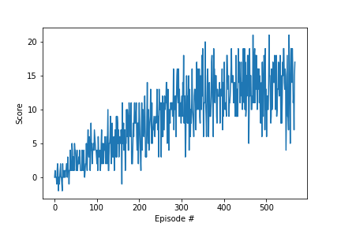

# Report

### Learning Algorithm
 

The algorithm implemented here was Deep Q-Learning. This implementation used a target network updated from an experience replay buffer every 4 time steps. The agent used an epsilon-greedy policy for action selection. 

 

The agent stores a copy of the previous frame's state vector. The concatenation of the previous and current observation are used for experience replay training and inference.

 
 

### Neural Network
 

The neural network architecture for this implementation was a 5 layer fully connected neural network with batch normalization layers between each fully connected layer. The input is expanded to 128 nodes, then down to 2 layers of 64 nodes each, then down to a layer of 32 nodes which then feed to the output layer.
 
 

### Hyperparameters
 

The initial hyper parameters for the network are as follows:
* Size of replay buffer: 10,000 trajectories
* Batch Size: 64
* Gamma: 0.95
* Tau (for % to update target network): 0.05
* Learning Rate: 0.005
* Steps before updating target network: 4

A hyper parameter study was done to determine sensitivity of this problem to various parameter changes. See [HyperStudy](./HyperStudy.ipynb)
 
 

## Future Work

The model could be improved by exploring the following areas:
* additional hyperparameters could be explored.
* additional network architectures could be explored
* a deep dive into the environment observation space could be done to gain further understanding.
* a deep dive into agent score variance with respect to different hyper parameters.
